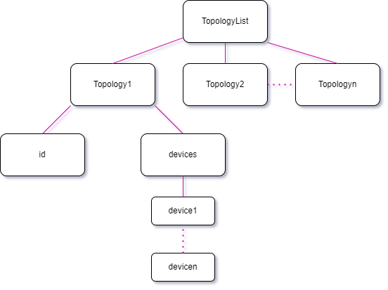

# Topology API
## Features
#### Provide the functionality to:
- Read a topology from a given JSON file and store it in the memory.
- Write a given topology from the memory to a JSON file.
- Query about which topologies are currently in the memory.
- Delete a given topology from memory.
- Query about which devices are in a given topology.
- Query about which devices are connected to a given netlist node in a given topology.

    TopologyList
    topologie
## API functions
```c++
int readJSON(TopologyList& list, const std::string& FileName);
std::vector<std::string> queryTopologies(TopologyList& list);
int writeJSON(std::shared_ptr<topology_s> topology, const std::string& FileName);


int deleteTopology(TopologyList& list, const std::string& TopologyID);
DeviceList queryDevices(TopologyList& list, const std::string& TopologyID);

DeviceList queryDevicesWithNetlistNode(TopologyList& list, const std::string& TopologyID, const std::string& NetlistNodeID);
```




