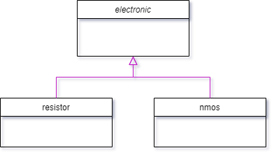

# Topology API

This project was requested by [Master Micro](https://www.master-micro.com/) as a software challange for mid-year internship. 


## Features
#### Provide the functionality to:
- Read a topology from a given JSON file and store it in the memory.
- Write a given topology from the memory to a JSON file.
- Query about which topologies are currently in the memory.
- Delete a given topology from memory.
- Query about which devices are in a given topology.
- Query about which devices are connected to a given netlist node in a given topology.


## Resources
[nlohmann json](https://github.com/nlohmann/json) library proved its capabilities to ease the process of parsing JSON files.
## Data structure diagram

#### Code
```c++
typedef std::vector<std::shared_ptr<electronic>> DeviceList;
typedef struct topology_s topology_s;
typedef std::vector<std::shared_ptr<topology_s>> TopologyList;
```

## API documentation
### summary
```c++
int readJSON(TopologyList& list, const std::string& FileName);
std::vector<std::string> queryTopologies(TopologyList& list);
int writeJSON(std::shared_ptr<topology_s> topology, const std::string& FileName);
int deleteTopology(TopologyList& list, const std::string& TopologyID);
DeviceList queryDevices(TopologyList& list, const std::string& TopologyID);
DeviceList queryDevicesWithNetlistNode(TopologyList& list, const std::string& TopologyID, const std::string& NetlistNodeID);
```
## Description

 #### readJSON
 ##### Brief:
 this function reads topology from "FileName" and stores it in the "list"
 ##### Note:
FileName is assumed to be a valid JSON file
 ##### Parameters:
 **list**: TopologyList created by the user
**FileName**: the name of the json file to read from
##### Return:
Returns 1 if success and 0 if there's a problem:
-  File could not be opened.
```c++
int readJSON(TopologyList& list, const std::string& FileName);
```

 #### queryTopologies
 ##### Brief:
 This function return a list of strings of topologies IDs
 ##### Parameters:
**list**: list TopologyList created by the user
##### Return:
Returns a vector of strings to topologies IDs.
```c++
std::vector<std::string> queryTopologies(TopologyList& list);
```

#### writeJSON
##### Brief:
 This function writes the given "topology" into the "FileName" in JSON structured-style
##### Note:
FileName is assumed to be a valid JSON file
##### Parameters:
**list**: list TopologyList created by the user

**FileName**: the name of the json file to write to
##### Return:  
Returns 1 if success and 0 if there's a problem:
- File could not be opened.
- The topology id is NULL
```c++
int writeJSON(std::shared_ptr<topology_s> topology, const std::string& FileName);
```

#### deleteTopology
##### Brief:
 This function deletes a Topology from the given "list" identified by the "TopologyID"
##### Parameters:
**list**: list TopologyList created by the user

**TopologyID**: The ID of the topology wanted to be deleted
##### Return:
Returns 1 if topology is found and deleted, and 0 if there's a problem:
- Topology could not be found
```c++
int deleteTopology(TopologyList& list, const std::string& TopologyID);
```

#### queryDevices
##### Brief:
 This function iterates over the TopologyList and returns a DeviceList for a Topology with id "TopologyID"
##### Parameters:
**list**: TopologyList created by the user

**TopologyID**: The ID of the topology wanted to be returned
##### Return:
- Returns a DeviceList for the Topology with ID "TopologyID"
- Returns empty DeviceList if "TopologyID" not found
```c++
DeviceList queryDevices(TopologyList& list, const std::string& TopologyID);
```


#### queryDevicesWithNetlistNode
##### Brief:
 This function iterates over the Topology's components with ID "TopologyID" and returns a DeviceList that contains all components that are connected to the netlist node.
##### Parameters:
**list**: TopologyList created by the user

**TopologyID**: The ID of the topology wanted to be checked

**NetlistNodeID**: the netlist node id, that we are checking connectivity to it.
##### Return:
 Returns a DeviceList for components that are connected to the "NetlistNodeID"
- Returns empty DeviceList if "TopologyID" not found
- Returns empty DeviceList if no deviced connected to the netlist node
```c++
DeviceList queryDevicesWithNetlistNode(TopologyList& list, const std::string& TopologyID, const std::string& NetlistNodeID);
```

## Class documentation


#### Code
```c++
class electronic
{
private:
    std::string type, id, valname;
    struct valstruct { float xdefault, min, max; }; valstruct value;
    std::map<std::string, std::string> netlist;
public:
    //setters
    void set_type(const std::string& str);
    void set_id(const std::string& str);
    void set_valname(const std::string& str);
    void set_val_default(float val);
    void set_val_min(float val);
    void set_val_max(float val);
    void netlist_insert(const std::string& key, const std::string& str);
    void netlist_setval(const std::string& key, const std::string& val);
    //getters
    std::string get_type(void);
    std::string get_id(void);
    std::string get_valname(void);
    float get_val_default(void);
    float get_val_min(void);
    float get_val_max(void);
    std::string netlist_getval(const std::string&);
    const std::map<std::string, std::string>* netlist_getall(void);
};

class resistor : public electronic
{
public:
    explicit resistor(const std::string& id);
};

class nmos : public electronic
{
public:
    explicit nmos(const std::string& id);
};
```
## Description
##### Private variables:
> Note: All private variables refer to the component description in the JSON file

**id:** The component id.

**type:** The component type.

**valname:** Refers to the properties object name such as "resistance" and "m(1)".

**valstruct:** It's a  structure refers to the properties object elements, it's assumed that all components have default, min and max values.

**netlist:** Refers to the component netlist and due to the difference of components terminals, this was declared as a map to accept diverse names. 

##### Public variables:
Public variables are simply getters and setters of previousely mentioned variables.

#### Class resistor:
* This class is inherited from electronic class and has only one public function which is the class constructor.
* The class constructor that takes id as input, initializes the common values between all resistor components like type = "resistor", valname  = "Resistance" and netlist terminals "t1" and "t2".

#### Class nmos 
* This class is inherited from electronic class and has only one public function which is the class constructor.
* The class constructor that takes id as input, initializes the common values between all nmos components like type = "nmos", valname  = "m(1)" and netlist terminals "drain", "gate" and "source".

### And finally, all thanks to [Master Micro](https://www.master-micro.com/) for providing such fun journey.
